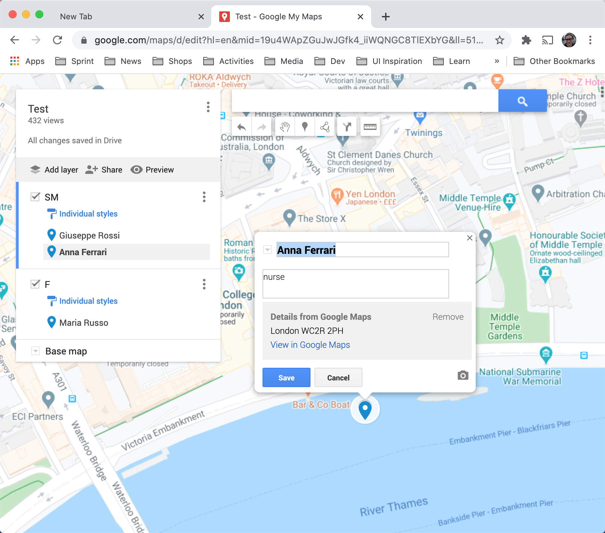
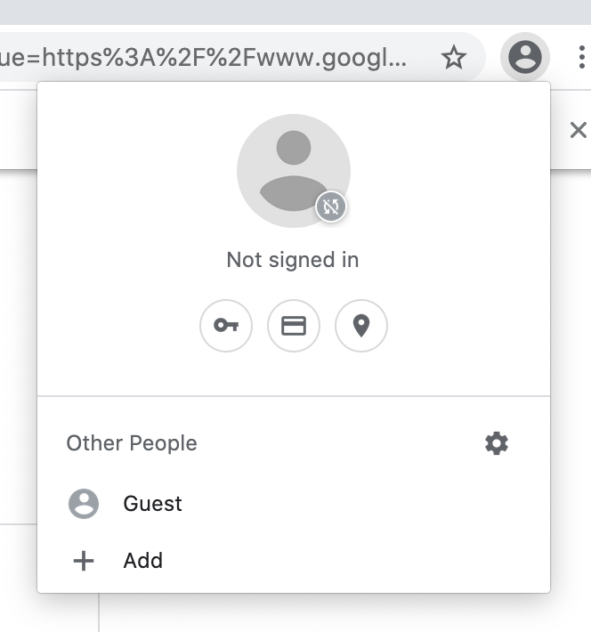
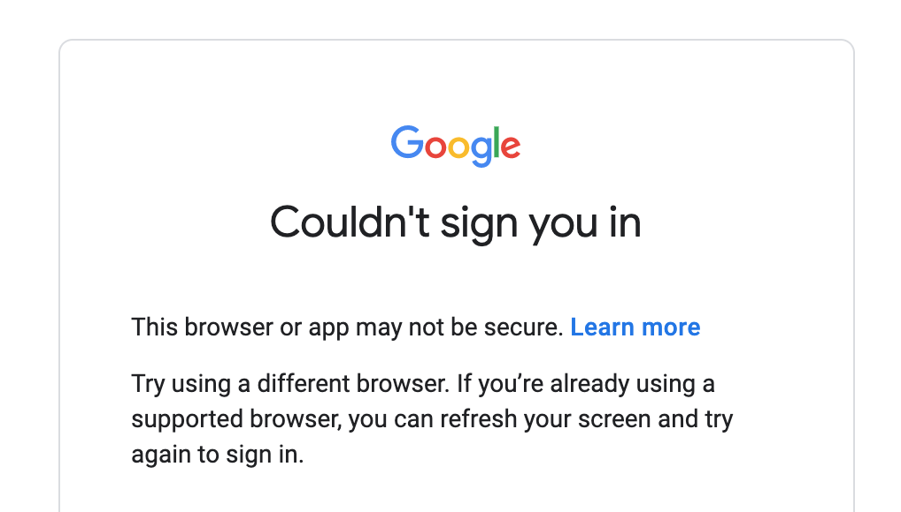

# Generate map locations on Google map

This program open and connect your browser to automate manual interactions with your browser. 
It uses CSV file as data source to add your locations on yours google map.



# Problem definition
Maintaining 200 or more locations on a google map, it is a long and tedius work.
I looked for a solution to automate this repetitive work.
I tried first to use pupeteer chronium and to *launch* my chrome browser but it was not possible to login to google map.



Google has also some security against automation tool. 



I then used puppeteer *connect* and started my browser with `remote-debugging-port` flag to allow puppeteer to communicate with my browser with websocket.

## Setup

### Setup `.env` file
create on the root project a file `.env` and the following line:
```
CHROME_EXE_PATH = "{executable path}"
```
replace the `"{executable path}"` with the relevant browser executable path.
You can easily find if you open the on chrome `chrome://version/` they show it under `Executable Path`

### Change google map page
Inside `config.json` you can change the `PAGE` URL property value to the map you want to save.
```
{
    "PAGE": "https://www.google.com/maps/d/edit?hl=en&mid=19u4WApZGuJwJGfk4_iiWQNGC8TlEXbYG&ll=54.83361322148431%2C-3.4359725000000108&z=5",
    ...
}
```

### Change data and mappings
The program is decouple from its data source, 
you can place you data in `./data/data.csv` and you can define your mappings in `./data/map.csv`.
`map.csv` uses [string-template](https://www.npmjs.com/package/string-template) to do the interpolation, follow the library template to take full advatange of the mapping functionality.

**data.csv**
```csv
Name, Surname, Postcode
Luca, Ferrari, AA00AAA
```

**map.csv**
```csv
locationName,      locationDescription
{Name} {Surname},  this is the {address}
```

**output**
```csv
locationName,  locationDescription
Luca Ferrari,  this is the AA00AAA
```

### Start program
install depedencies and start program
```
npm i
npm start
```
